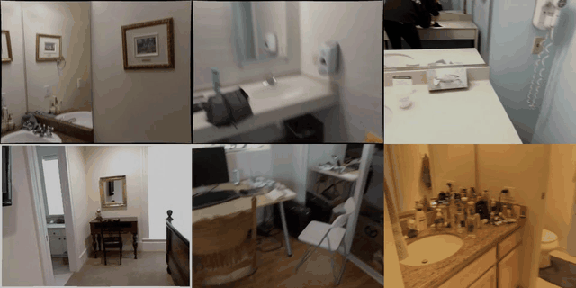

<div align="center">

# MirrorWorld: Taming Video Diffusion Models for Mirror Reflection Generation

[**Youjun Zhao**](https://youjunzhao.github.io/)<sup>1</sup>, **Alex Warren<sup>2</sup>**, **Gary K. L. Tam<sup>2</sup>**, **Rynson W. H. Lau<sup>1</sup>**

<sup>1</sup>City University of Hong Kong &nbsp;&nbsp; <sup>2</sup>Swansea University

[**📄[arXiv]**](https://arxiv.org/abs/2608.07463) **|** [**🔥[Project]**](https://youjunzhao.github.io/MirrorWorld/) **|** [**💻[Code]**](https://github.com/YoujunZhao/MirrorWorld) **|** [**🧩[Data]**](https://youjunzhao.github.io/MirrorWorld/#benchmark)

</div>

<p align="center">
  
</p>

## 📑 Todo List

- [ ] Inference code & checkpoints
- [ ] Training code


## 🙏 Citation


```bibtex
@misc{mirrorworld,
  title        = {MirrorWorld: Taming Video Diffusion Models for Mirror Reflection Generation},
  author       = {Youjun Zhao and Alex Warren and Gary K. L. Tam and Rynson W. H. Lau},
  year         = {2026},
  eprint       = {2608.07463},
  archivePrefix = {arXiv},
  primaryClass = {cs.CV},
  url          = {https://arxiv.org/abs/2608.07463},
}
```
